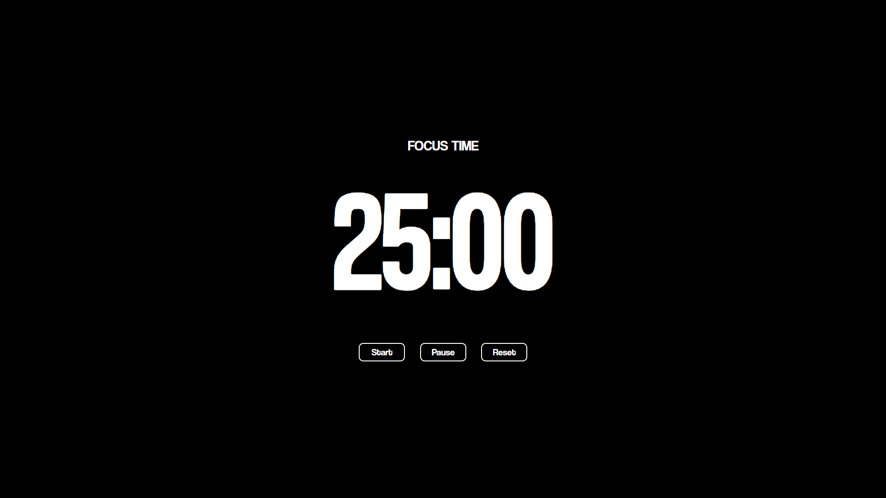

<div align="center">

# 🍅 Pomodoro Timer

**Stay focused, stay productive!**

*A beautiful and simple Pomodoro Timer built with vanilla JavaScript*



[](https://opensource.org/licenses/MIT)
[](https://developer.mozilla.org/en-US/docs/Web/JavaScript)
[]()
[]()

[🚀 **Try it Live**](https://muhaideennausar.github.io/pomodoro-timer/) • [📋 **Report Bug**](https://github.com/muhaideennausar/pomodoro-timer/issues) • [✨ **Request Feature**](https://github.com/muhaideennausar/pomodoro-timer/issues)

</div>

---

## 📚 Table of Contents

- [✨ Features](#-features)
- [🎯 About the Pomodoro Technique](#-about-the-pomodoro-technique)
- [🎮 Demo](#-demo)
- [⚡ Quick Start](#-quick-start)
- [📁 Project Structure](#-project-structure)
- [🛠️ Technology Stack](#-technology-stack)
- [📱 Screenshots](#-screenshots)
- [🎨 Customization](#-customization)
- [🤝 Contributing](#-contributing)
- [📄 License](#-license)
- [👨‍💻 Author](#-author)
- [⭐ Support](#-support)

---

## ✨ Features

<div align="center">

| Feature | Description |
|---------|-------------|
| ⏰ **Focus Sessions** | Classic 25-minute focused work sessions |
| ☕ **Break Time** | Refreshing 5-minute breaks between sessions |
| 🎵 **Audio Alerts** | Beautiful bell sound notifications |
| ⏯️ **Timer Controls** | Start, pause, and reset functionality |
| 🔄 **Auto Transitions** | Seamless switching between focus and break modes |
| 📱 **Responsive Design** | Perfect on desktop, tablet, and mobile |
| 🎨 **Clean UI** | Minimalist and distraction-free interface |
| 🚫 **No Dependencies** | Pure vanilla JavaScript - no frameworks needed |

</div>

---

## 🎯 About the Pomodoro Technique

> *The Pomodoro Technique is a time management method developed by Francesco Cirillo in the late 1980s.*

**How it works:**

1. 🍅 Choose a task to work on
2. ⏲️ Set the timer for 25 minutes
3. 💪 Work on the task until the timer ends
4. ✅ Take a short 5-minute break
5. 🔄 Repeat the process

**Benefits:**
- 📈 **Improved Focus** - Eliminates distractions during work sessions
- ⚡ **Enhanced Productivity** - Maintains high energy levels throughout the day
- 🧠 **Better Time Management** - Provides clear structure to your work
- 🎯 **Goal Achievement** - Breaks large tasks into manageable chunks

---

## 🎮 Demo

<div align="center">

### 🌐 **[Try the Live Demo](https://muhaideennausar.github.io/pomodoro-timer/)**

*Experience the timer in action!*

</div>

---

## ⚡ Quick Start

### 📥 Installation

```bash
# Clone the repository
git clone https://github.com/muhaideennausar/pomodoro-timer.git

# Navigate to project directory
cd pomodoro-timer

# Open in your default browser
open index.html
```

### 🎯 Usage

1. **🚀 Start Timer**: Click the "Start" button to begin your focus session
2. **⏸️ Pause Timer**: Need a quick interruption? Hit "Pause" to temporarily stop
3. **🔄 Reset Timer**: Click "Reset" to return to the default 25-minute focus time
4. **🔔 Listen for Alerts**: The bell will chime when it's time to take a break!
5. **🔄 Automatic Switching**: The timer automatically alternates between focus and break modes

---

## 📁 Project Structure

```
🍅 pomodoro-timer/
├── 📄 index.html          # Main HTML structure
├── 🎨 style.css           # Beautiful styling and responsive design
├── ⚡ script.js           # Timer logic and functionality
├── 🔔 bell.mp3            # Notification sound effect
├── 📸 screenshot.png      # Preview image
├── 📁 Fonts/              # Custom fonts directory
├── 📁 .github/            # GitHub templates and workflows
├── 📄 LICENSE             # MIT License
└── 📖 README.md           # This beautiful documentation
```

---

## 🛠️ Technology Stack

<div align="center">

| Technology | Usage | Why? |
|------------|-------|------|
|  | Structure | Semantic markup for accessibility |
|  | Styling | Modern flexbox and responsive design |
|  | Functionality | Pure vanilla JS for maximum performance |

</div>

**Key Features:**
- 🚫 **Zero Dependencies** - No external libraries required
- ⚡ **Lightweight** - Optimized for fast loading
- 📱 **Mobile-First** - Responsive design principles
- 🎨 **Modern CSS** - Flexbox and CSS Grid
- ♿ **Accessible** - Screen reader friendly

---

## 📱 Screenshots

<div align="center">

### 🖥️ Desktop View


*Clean, minimal interface perfect for focused work sessions*

</div>

---

## 🎨 Customization

### ⏰ Modify Timer Durations

Edit the values in `script.js`:

```javascript
// Customize your session lengths (in seconds)
const FOCUS_TIME = 25 * 60;  // 25 minutes focus
const BREAK_TIME = 5 * 60;   // 5 minutes break

// For longer sessions, try:
// const FOCUS_TIME = 50 * 60;  // 50 minutes focus
// const BREAK_TIME = 10 * 60;  // 10 minutes break
```

### 🎵 Change Notification Sound

Replace `bell.mp3` with your preferred sound file (keep the same filename).

### 🎨 Customize Colors

Modify the CSS variables in `style.css`:

```css
:root {
  --primary-color: #e74c3c;    /* Main theme color */
  --secondary-color: #2ecc71;  /* Success/break color */
  --background-color: #f8f9fa; /* Background */
  --text-color: #2c3e50;       /* Text color */
}
```

---

## 🤝 Contributing

<div align="center">

**Contributions are welcome! 🎉**

</div>

### 🚀 How to Contribute

1. **🍴 Fork** the repository
2. **🌟 Create** a feature branch (`git checkout -b feature/AmazingFeature`)
3. **💾 Commit** your changes (`git commit -m 'Add some AmazingFeature'`)
4. **📤 Push** to the branch (`git push origin feature/AmazingFeature`)
5. **🔃 Open** a Pull Request

### 💡 Ideas for Contributions

- 🎨 **UI Enhancements** - Better animations, themes, or layouts
- 🔧 **New Features** - Long break intervals, task tracking, statistics
- 🐛 **Bug Fixes** - Found an issue? Help us fix it!
- 📚 **Documentation** - Improve README or add code comments
- 🌐 **Internationalization** - Add support for multiple languages
- 📱 **PWA Features** - Make it installable as a Progressive Web App

### 🐛 Bug Reports

Found a bug? Please create an issue with:
- 📝 **Description** of the bug
- 🔄 **Steps to reproduce**
- 💻 **Browser and OS** information
- 📸 **Screenshots** if applicable

---

## 📄 License

<div align="center">

📝 This project is licensed under the **MIT License**

*See the [LICENSE](LICENSE) file for details*

[](https://opensource.org/licenses/MIT)

**TL;DR** - You can do whatever you want with this code!

</div>

---

## 👨‍💻 Author

<div align="center">

**Haja Muhaideen Nausar**

*Student, Developer & Creator from Chennai* 🇮🇳

[](https://github.com/muhaideennausar)
[]()

*"Building simple solutions for everyday productivity challenges"*

</div>

---

## ⭐ Support

<div align="center">

### 💖 **Love this project?**

**Give it a ⭐ star on GitHub — it motivates me a lot!**

[](https://github.com/muhaideennausar/pomodoro-timer)

---

### 🔗 **Share it with the world!**

[](https://twitter.com/intent/tweet?text=Check%20out%20this%20amazing%20Pomodoro%20Timer!&url=https://github.com/muhaideennausar/pomodoro-timer)

---

### 📬 **Get in touch**

- 💬 **Questions?** Open an [issue](https://github.com/muhaideennausar/pomodoro-timer/issues)
- 🐛 **Bug reports** are welcome!
- 💡 **Feature requests** are appreciated!

---

*Made with ❤️ and lots of ☕ in Chennai*

**Happy Productivity! 🚀**

</div>